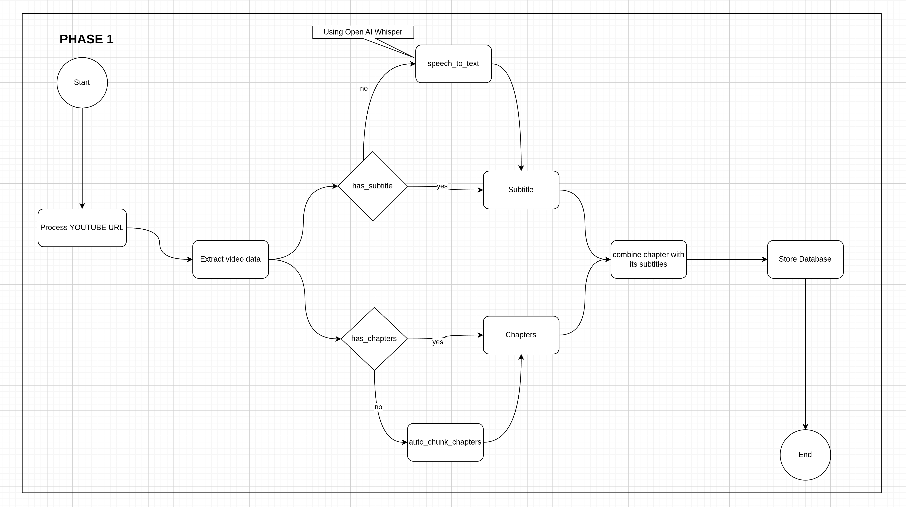
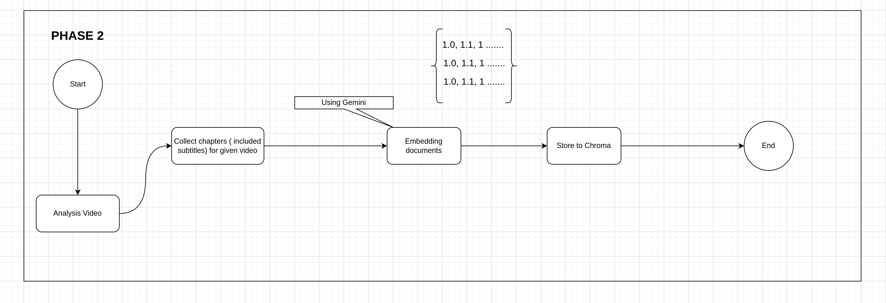
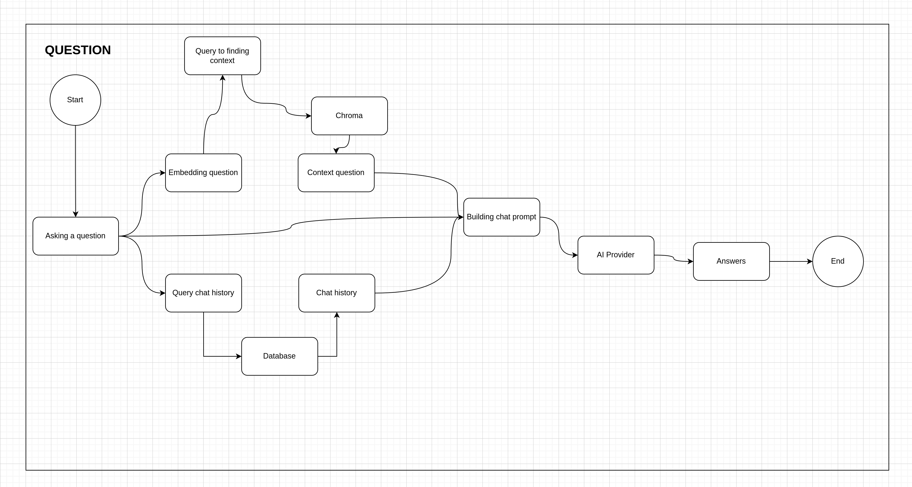

# AskTube
**AI-Powered Summarizer, QA Assistant on YouTube Videos 🤖.**

*Run it entirely on your local machine with Ollama, or cloud-based models like Claude, OpenAI, Gemini, Mistral, and more.*

---
## 🔨 Technology

- **Language**: Python, JS
- **Framework/Lib**: Sanic, Peewee, Pytubefix, Sentence Transformers, Sqlite, Chroma, VueJs, etc.
- **Embedding Provider**:
  - [x] OpenAI
  - [x] Gemini
  - [x] VoyageAI
  - [x] Mistral
  - [x] Sentence Transformers (Local)
- **AI Provider**: 
  - [x] OpenAI
  - [x] Claude
  - [x] Gemini
  - [x] Mistral
  - [x] Ollama (Local)
- **Speech To Text**:
  - [x] OpenAI Whisper (Local)
  - [ ] OpenAI Whisper (Cloud)

---
## 🤷🏽 Why does this project exist?

- I’ve seen several GitHub repositories offering **AI-powered** summaries for YouTube videos, but none include **Q&A**
  functionality.
- I want to implement a more comprehensive solution while also gaining experience with AI to build my own RAG application.

---
## 💡 The Idea / Architecture

> The real implementation might differ from this art due to its complexity.

### 1️⃣ Extract data from given URL

### 2️⃣ Storing embedding chapter subtitles

### 3️⃣ Asking (included enrich question)

---
## 🔊 Notice

> 1. Do not use this for production. This aimed for end-users on their local machines.
> 2. Do not request any advanced features for management.

----
## 🏃🏽‍➡️ Demo

> [Placeholder]

---
## ⁉️ FAQ

1. Does I need paid API to run?
  - No, you can fully run in your local machine if your pc have ability
  - You can still using free API to run with some limitations.
2. [Placeholder]
