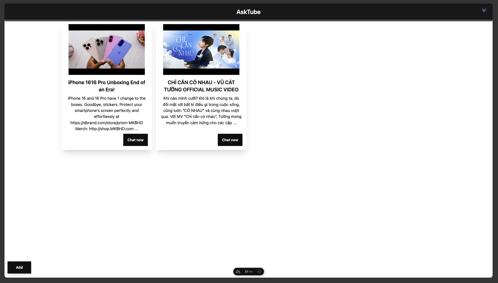
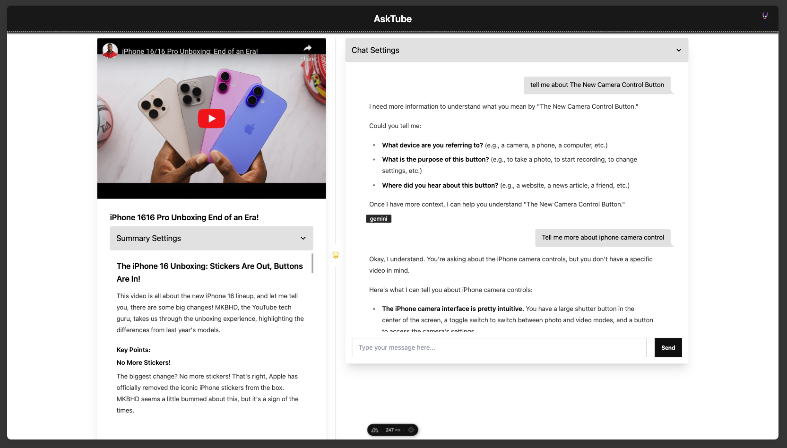
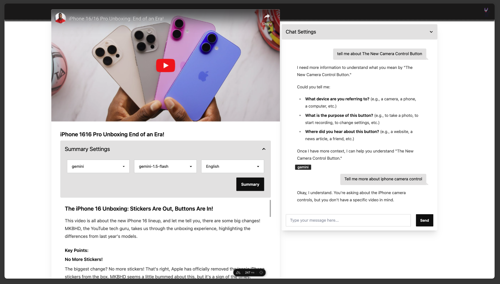
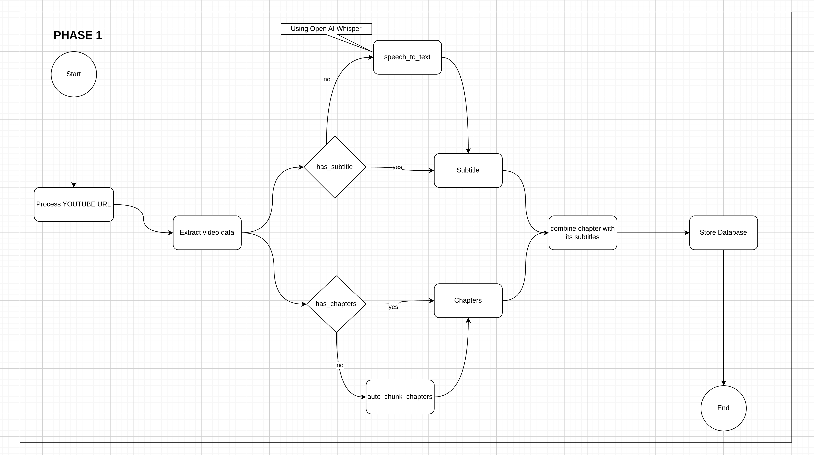
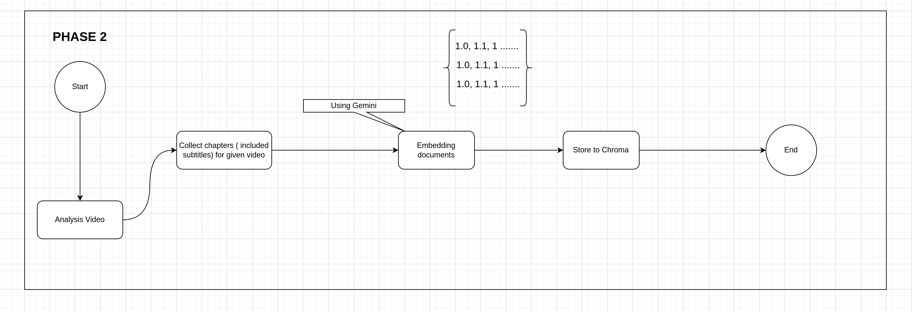

<p align="center">
  
</p>
<p align="center">
  <strong>AskTube - An AI-powered YouTube video summarizer and QA assistant powered by Retrieval Augmented Generation (RAG) 🤖</strong>
</p>
<p align="center">
  <i>Run it entirely on your local machine with Ollama, or cloud-based models like Claude, OpenAI, Gemini, Mistral, and more</i>
</p>

---
## 🏃🏽‍➡️ Demo & Screenshot

<p align="center">
  
</p>
<p align="center">
  
</p>

<p align="center">
  
</p>

## [Watch "AskTube First Demo" on YouTube](https://www.youtube.com/watch?v=S5T0nVjYRbQ)


https://github.com/user-attachments/assets/610ec00b-e25a-4ac5-900c-145c8485675f

---
## 💤 Features
- [x] Work even with unsubtitle video
- [x] No limit video time
- [x] Support multiple AI vendors
- [x] Focus on RAG implemetation
- [x] Fully run on your local machine 

## 🤷🏽 Why does this project exist?

- I’ve seen several GitHub repositories offering **AI-powered** summaries for YouTube videos, but none include **Q&A**
  functionality.
- I want to implement a more comprehensive solution while also gaining experience with AI to build my own RAG application.

---

## 🔨 Technology

- **Language**: Python, JS
- **Server**: Python@v3.10, Bun@v1
- **Framework/Lib**: Sanic, Peewee, Pytubefix, Sentence Transformers, Sqlite, Chroma, NuxtJs/DaisyUI, etc.
- **Embedding Provider (Analysis Provider)**:
  - [x] OpenAI
  - [x] Gemini
  - [x] VoyageAI
  - [x] Mistral
  - [x] Sentence Transformers (Local)
- **AI Provider**:
  - [x] OpenAI
  - [x] Claude
  - [x] Gemini
  - [x] Mistral
  - [x] Ollama (Local)
- **Speech To Text**:
  - [x] [Faster-Whisper (Local)](https://github.com/SYSTRAN/faster-whisper)
  - [x] [AssemblyAI](https://www.assemblyai.com/docs)
  - [x] [OpenAI](https://platform.openai.com/docs/guides/speech-to-text)
  - [x] [Gemini](https://ai.google.dev/gemini-api/docs/audio)

---

## 🗓️ Next Todo Tasks

- [ ] Implement Speech To Text for cloud models
  - [ ] AssemblyAI
  - [ ] OpenAI
  - [ ] Gemini
- [ ] Enhance
  - [x] ~Skip using RAG for short videos~
  - [ ] Chat prompts, chat messages by context limit
  - [ ] RAG: Implement Query Translation
    - [x] ~Multiquery~
    - [ ] Fusion
    - [ ] Decomposition
    - [ ] Step back
    - [ ] HyDE

---

## 🚀 How to run ?

> For the first time running, the program maybe a bit slow due they need to install local models.

### Run on your machine

- Ensure you installed:
  - [Python 3.10](https://www.python.org/downloads/)
    - **Windows User**, please [download here](https://www.python.org/downloads/release/python-31011/)
    - **Linux, MacOS User**, please use `homebrew` or your install package command `(apt, dnf, etc)`
    - Or use `conda`
  - [Poetry](https://python-poetry.org/docs/#installation)
    - **Windows User** open `Powershell` and run:

    ```shell
    (Invoke-WebRequest -Uri https://install.python-poetry.org -UseBasicParsing).Content | py -
    ```

    - **Linux, MacOS User** open `Terminal` and run:

    ```shell
    curl -sSL https://install.python-poetry.org | python3 -
    ```

  - [Bun](https://bun.sh/)
  - [ffmpeg](https://www.ffmpeg.org/download.html)
    - **MacOS User**

    ```shell
    brew install ffmpeg
    ```

    - **Linux User**

    ```shell
    # Ubuntu
    sudo apt install ffmpeg
    # Fedora
    sudo dnf install -y ffmpeg
    ```

    - **Windows**, please follow this tutorial [Install ffmpeg for Windows](https://phoenixnap.com/kb/ffmpeg-windows)
- Clone repostiory

  ```shell
  git clone https://github.com/jonaskahn/asktube.git
  ```

- Create file `.env` in `asktube/engine` directory:
  - [Locally](/engine#prefer-env-for-running-local)
  - [Free with some limitations](/engine#prefer-env-for-free-with-limitation)
- Run program

  - _You may need to run first:_

  ```shell
  poetry env use python
  ```

  - Open `terminal/cmd/powershell` in `asktube/engine` directory, then run:

  ```shell
  poetry install && poetry run python engine/server.py
  ```

  - Open `terminal/cmd/powershell` in `asktube/web` directory, then run:

  ```shell
  bun install && bun run dev
  ```

- Open web: [http://localhost:3000](http://localhost:3000)

### With docker (In process)

**Before You Start**

> 1. I built these services to docker images, but if you want to build local images, please run `build.local.bat` for **`Windows`** or `build.local.amd64.sh` or `build.local.aarch64.sh` for **`MacOS`**, **`Linux`**
> 2. If you have a GPU (cuda or rocm), please refer **ENV settings** above, change params like above

**Locally**

- Use [local.yaml](compose/local.yaml) compose file to start
- Open `terminal/cmd/powershell` in `asktube` directory

```shell
docker compose -f compose/local.yaml pull && docker compose -f compose/local.yaml up -d
```

- After run, you need install `Ollama` model `qwen2` and `llama3.1` for QA

```shell
docker run ollama ollama run qwen2
docker run ollama ollama run llama3.1
```

**Free** (with rate limit)

- You need to go Google Gemini and VoyageAI to register account and generate your own API keys:
  - Gemini is free with your Google Account
  - VoyageAI (recommended by Claude) gives you free 50M tokens (a huge amount) but you need to add your credit card first.
- Replace your ENV setting in docker file [free](compose/free.yaml) and start docker
- Open `terminal/cmd/powershell` in `asktube` directory

```shell
docker compose -f compose/free.yaml pull && docker compose -f compose/free.yaml up -d
```

**Ideal**

- Using `VoyageAI` for embedding texts
- Using `OpenAI` and `Claude` for QA, register account and generate your own API keys
- Replace your ENV setting in docker file [ideal](compose/ideal.yaml) and start docker
- Open `terminal/cmd/powershell` in `asktube` directory

```shell
docker compose -f compose/ideal.yaml pull && docker compose -f compose/ideal.yaml up -d
```

**Result**

- Open web: [http://localhost:8080](http://localhost:8080)

---

## 💡 Architecture

> The real implementation might differ from this art due to its complexity.

### 1️⃣ Extract data from given URL



### 2️⃣ Storing embedding chapter subtitles



### 3️⃣ Asking (included enrich question)


---

## 🪧 Notice

> 1. Do not use this for production. This aimed for end-users on their local machines.
> 2. Do not request any advanced features for management.


## ✍🏿 For development

- [Backend](./engine/README.md)
- [Frontend](./web/README.md)

---

## ⁉️ FAQ and Troubleshooting

- [FQA](./docs/FQA.md)

---
