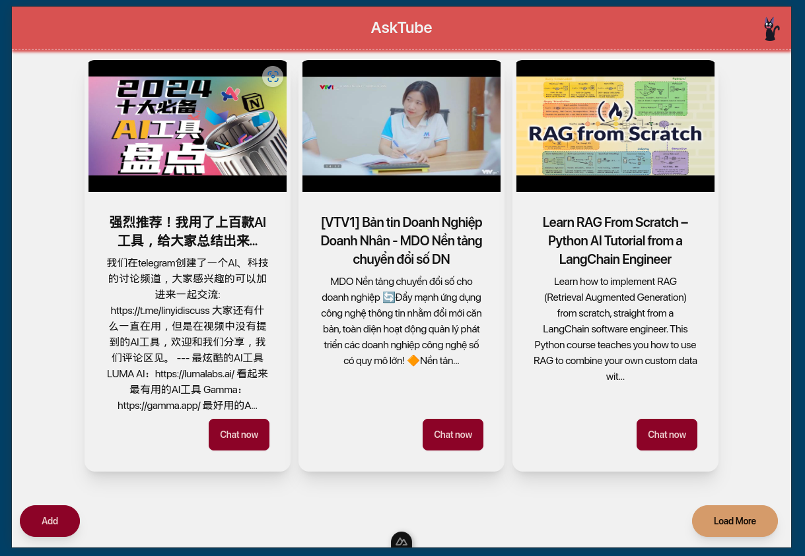

<p align="center">
  
</p>
<p align="center">
  <strong>AskTube - An AI-powered YouTube video summarizer and QA assistant powered by Retrieval Augmented Generation (RAG) 🤖</strong>
</p>
<p align="center">
  <i>Run it entirely on your local machine with Ollama, or cloud-based models like Claude, OpenAI, Gemini, Mistral, and more</i>
</p>

---
## Screenshot
<p align="center">
  
</p>

<p align="center">
  
</p>

## 🔨 Technology

- **Language**: Python, JS
- **Server**: Python@v3.10, Bun@v1
- **Framework/Lib**: Sanic, Peewee, Pytubefix, Sentence Transformers, Sqlite, Chroma, NuxtJs/DaisyUI, etc.
- **Embedding Provider**:
  - [x] OpenAI
  - [x] Gemini
  - [x] VoyageAI
  - [x] Mistral
  - [x] Sentence Transformers (Local)
- **AI Provider**:
  - [x] OpenAI
  - [x] Claude
  - [x] Gemini
  - [x] Mistral
  - [x] Ollama (Local)
- **Speech To Text**:
  - [x] Faster-Whisper (Local)
  - [ ] OpenAI
  - [ ] Gemini
 
## How to run ?
### Run on your machine
- Ensure you installed Python/Poetry and Bun before we start.
- Clone repostiory
  ```shell
  git clone https://github.com/jonaskahn/asktube.git
  ```
- Prepare ENV settings 
  - [Locally](/engine#prefer-env-for-running-local)
  - [Free with some limitations](/engine#prefer-env-for-free-with-limitation)
- Run program
  ```shell
  cd engine && poetry install && poetry python engine/server.py
  ```
  ```shell
  cd web && bun install && bun run dev
  ```
### With docker
[Placeholder]

---
## 🤷🏽 Why does this project exist?

- I’ve seen several GitHub repositories offering **AI-powered** summaries for YouTube videos, but none include **Q&A**
  functionality.
- I want to implement a more comprehensive solution while also gaining experience with AI to build my own RAG application.

---

## 💡 Architecture

> The real implementation might differ from this art due to its complexity.

### 1️⃣ Extract data from given URL


### 2️⃣ Storing embedding chapter subtitles


### 3️⃣ Asking (included enrich question)


---

## 🔊 Notice

> 1. Do not use this for production. This aimed for end-users on their local machines.
> 2. Do not request any advanced features for management.

---

## 🏃🏽‍➡️ Demo

[AskTube First Demo](https://www.youtube.com/watch?v=TkoxcM6NcB4)
---

## ✍🏿 For development

- [Backend](./engine/README.md)

---

## ⁉️ FAQ and Troubleshooting
- [FQA](./docs/FQA.md)
